# Terraform AWS Static Website

This project demonstrates how to provision and deploy a static website on AWS using Terraform. Instead of manually creating AWS resources through the AWS Management Console, the infrastructure is defined as code, making deployments repeatable, consistent, and version-controlled.

---

## Technologies

* Terraform
* AWS S3
* AWS IAM
* AWS CLI
* Git
* GitHub

---

## Project Structure

```text
terraform-aws-static-website
├── website
│   ├── index.html
│   └── style.css
├── screenshots
├── provider.tf
├── variables.tf
├── main.tf
├── outputs.tf
├── terraform.tfvars
├── .gitignore
└── README.md
```

---

## Infrastructure

This project provisions:

* Amazon S3 Bucket
* Static Website Hosting
* Public Access Configuration
* Bucket Policy
* Website File Upload (HTML & CSS)
* Terraform Outputs

---

## Terraform Workflow

### Project Structure

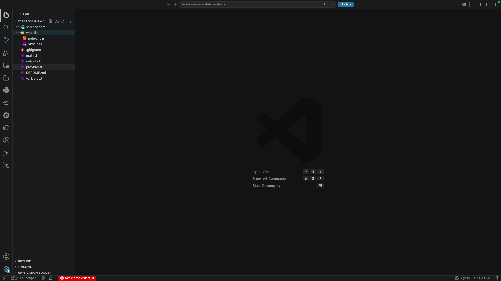

---

### Configure AWS Provider and Variables

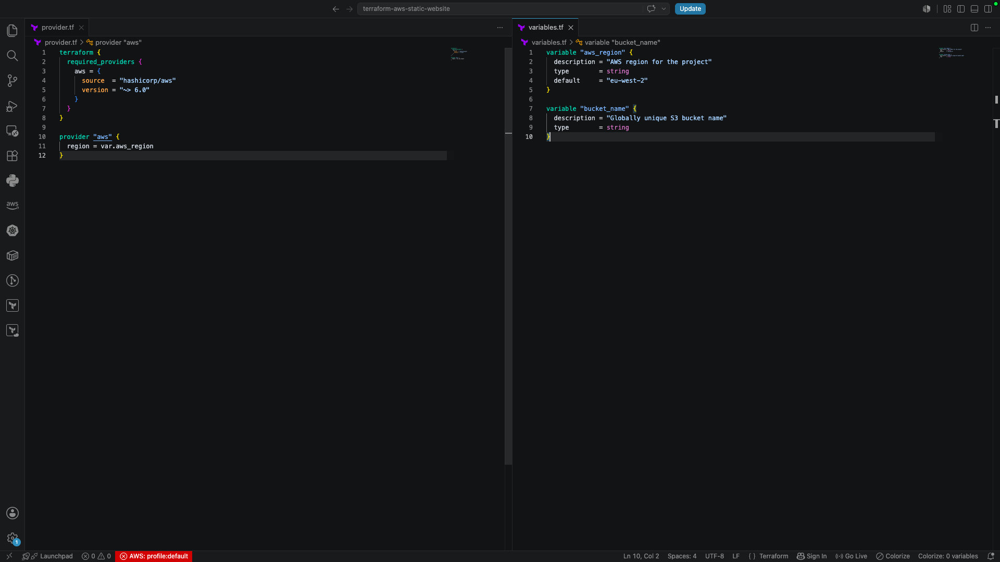

The AWS provider and reusable variables were configured before creating any infrastructure.

---

### Initialize Terraform

```bash
terraform init
```

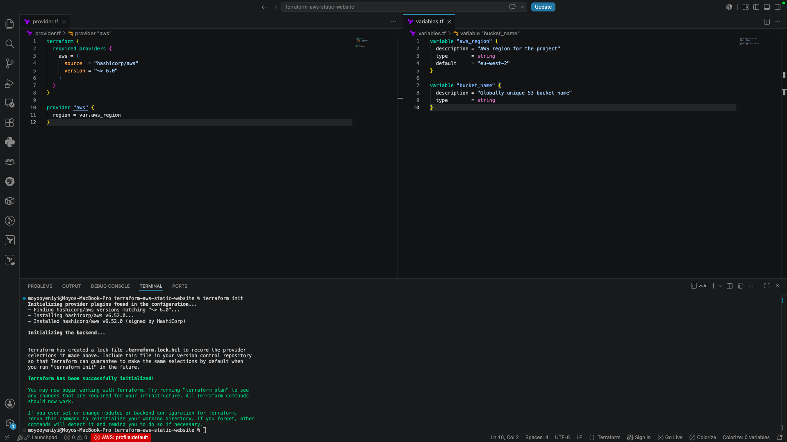

---

### Create the S3 Bucket Resource

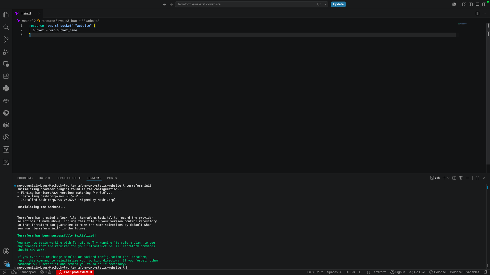

The first Terraform resource provisions an Amazon S3 bucket that will host the website.

---

### Configure Static Website Hosting

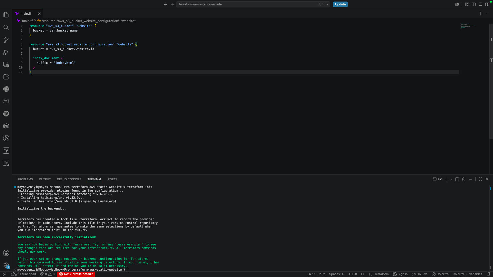

The bucket is configured to serve static website content.

---

### Configure Public Access

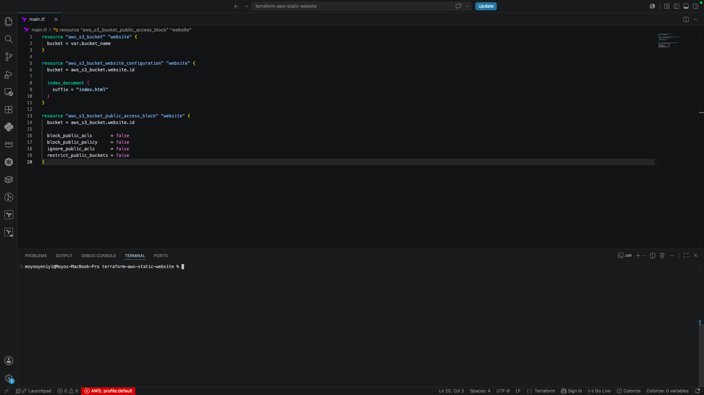

Public access settings were updated to allow website hosting.

---

### Create the Bucket Policy

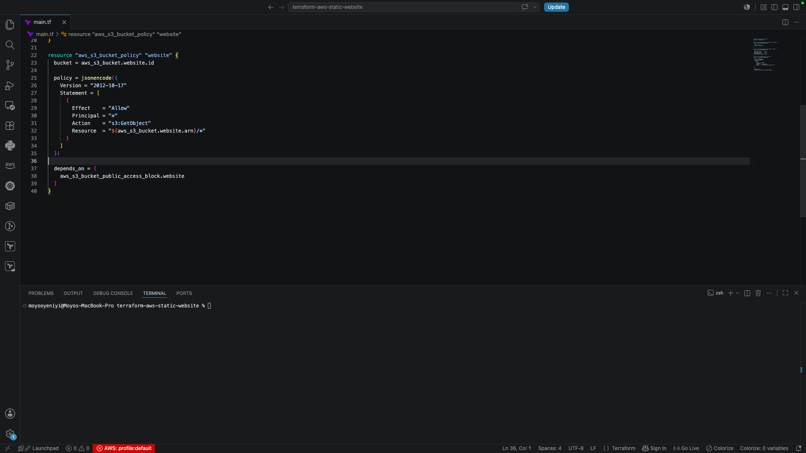

A bucket policy grants public read access to the website files.

---

### Upload Website Files

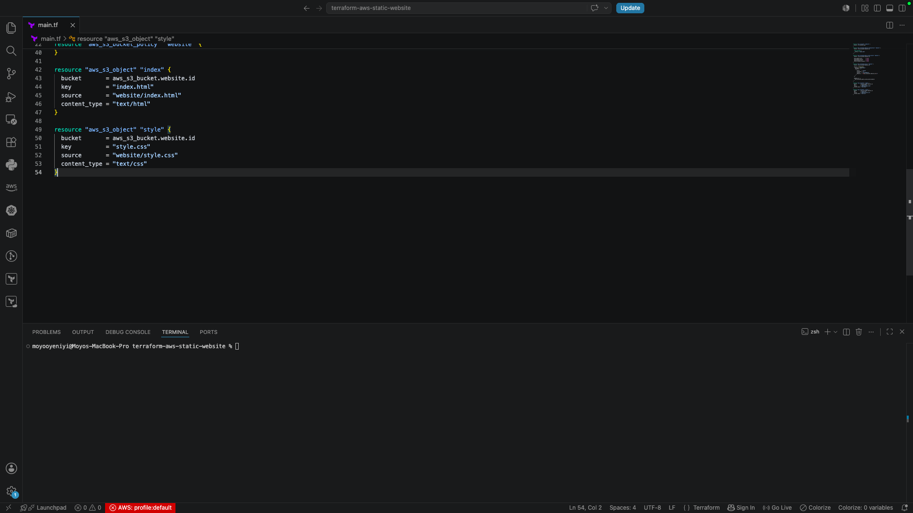

Terraform uploads the HTML and CSS files directly into Amazon S3.

---

### Website Source Files

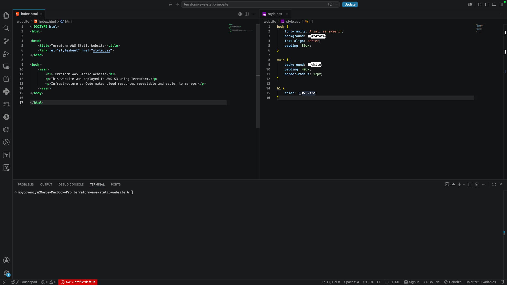

The website consists of a simple HTML page styled with CSS.

---

### Configure Terraform Outputs

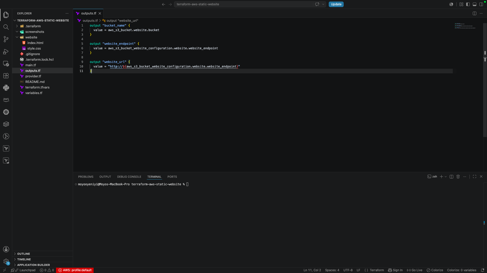

Outputs return useful deployment information such as the bucket name and website URL.

---

### Validate the Configuration

```bash
terraform validate
```

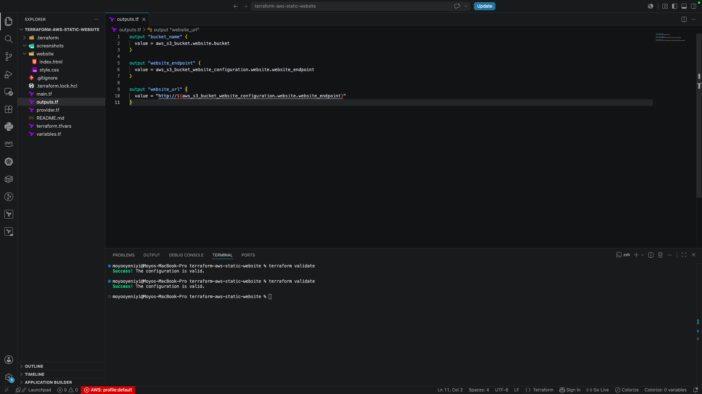

Terraform confirmed that the configuration was valid.

---

### Troubleshoot AWS Credentials

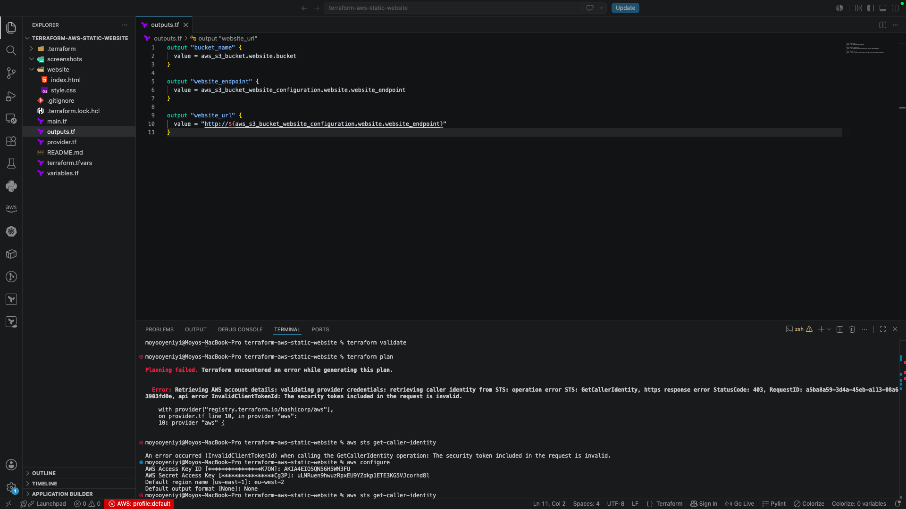

During the first deployment attempt, Terraform could not authenticate because the AWS CLI credentials were invalid. After updating the AWS CLI configuration, Terraform was able to communicate with AWS successfully.

---

### Verify AWS CLI Connection

```bash
aws sts get-caller-identity
```

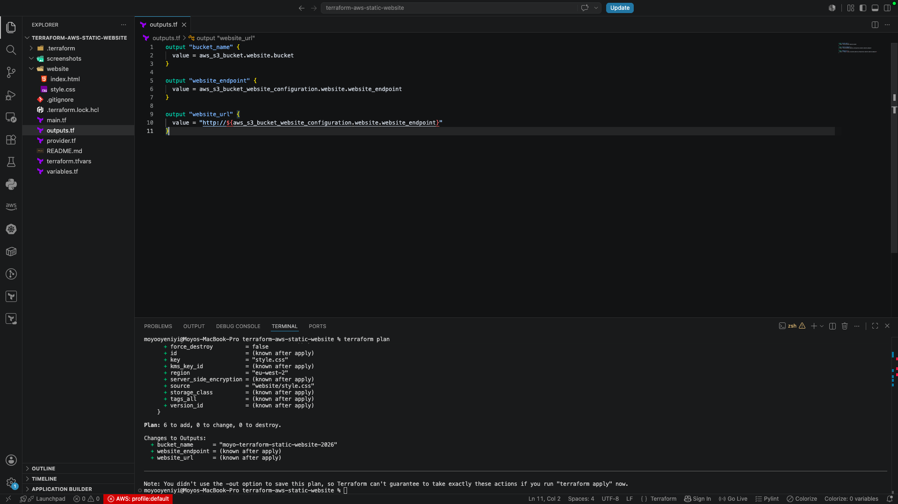

This command verified that the AWS CLI was correctly authenticated.

---

### Review the Deployment Plan

```bash
terraform plan
```

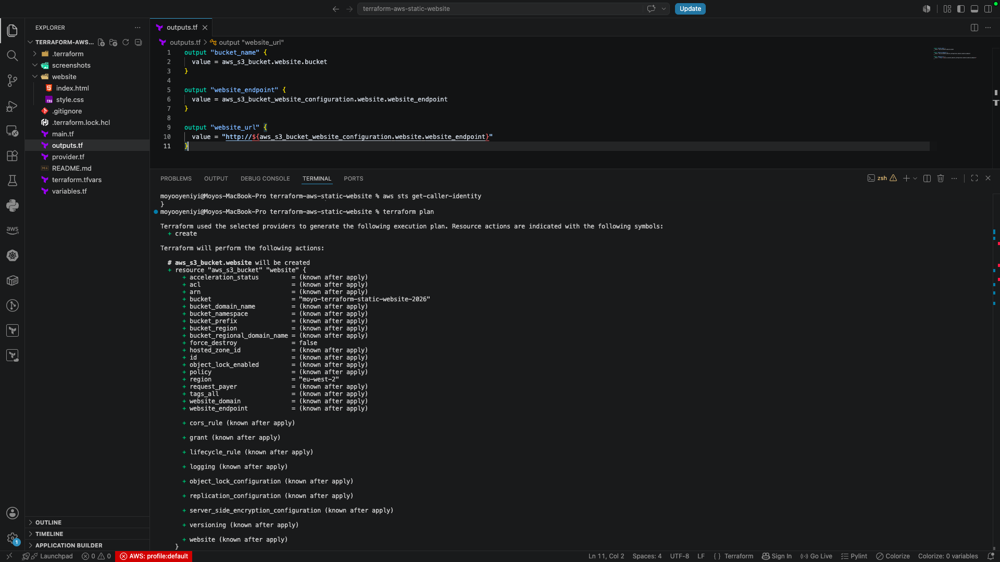

Terraform displayed the execution plan showing the resources that would be created.

---

### Resolve IAM Permissions


The initial deployment failed because the IAM user did not have permission to create an S3 bucket. After the required permissions were added, the deployment completed successfully.

---

### Deploy the Infrastructure

```bash
terraform apply
```

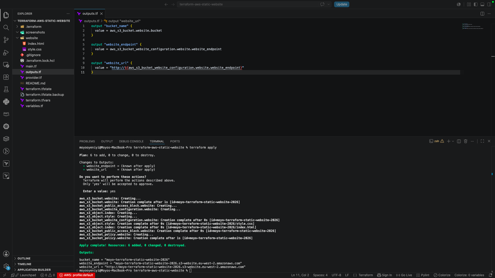

Terraform successfully provisioned the AWS infrastructure.

---

### Live Website

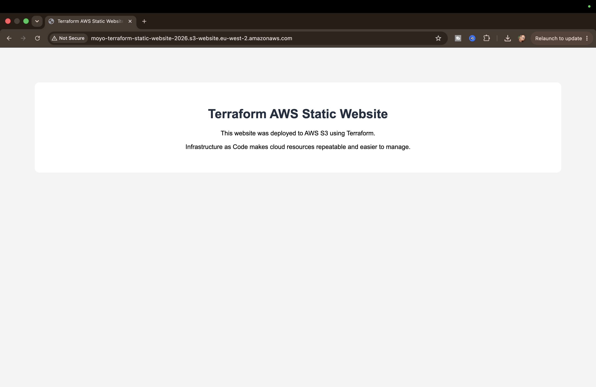

The website was successfully deployed and accessible through the S3 static website endpoint.

---

### Terraform Outputs

```bash
terraform output
```

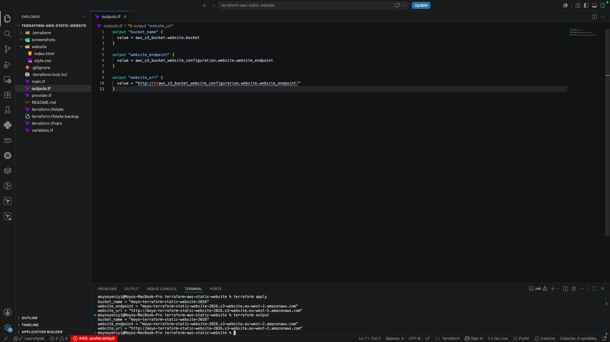

Terraform displayed the deployment outputs, including the bucket name and website URL.

---

## What I Learned

* Provisioning AWS infrastructure using Terraform
* Creating and configuring Amazon S3 buckets
* Hosting static websites with Amazon S3
* Managing infrastructure with Infrastructure as Code (IaC)
* Using Terraform variables and outputs
* Configuring AWS CLI credentials
* Troubleshooting IAM permission issues
* Deploying cloud infrastructure in a repeatable way

---

## Future Improvements

* Add CloudFront for content delivery
* Configure a custom domain with Route 53
* Enable HTTPS using AWS Certificate Manager
* Store Terraform state remotely in an S3 backend
* Automate deployments with GitHub Actions
